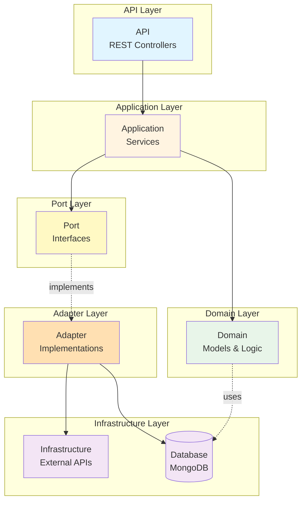

# 전체 아키텍처 개요 (Hexagonal Architecture)

이 다이어그램은 프로젝트의 헥사고날 아키텍처 전체 구조를 간단하게 보여줍니다.



## 아키텍처 레이어 설명

### API
REST Controllers - 외부 HTTP 요청 처리

### Application
비즈니스 로직 조율 및 유스케이스 구현

### Port
외부 시스템과의 추상화된 인터페이스

### Domain
핵심 비즈니스 로직 및 도메인 모델

### Adapter
Port 인터페이스의 실제 구현체

### Infrastructure
외부 API 클라이언트 및 데이터베이스 연결

## 의존성 역전 원칙

```
Application (고수준)
    ↓ 의존
Port (인터페이스)
    ↑ 구현
Adapter (저수준)
```