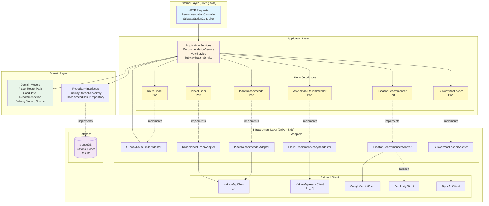

# 전체 아키텍처 개요 (Hexagonal Architecture)

이 다이어그램은 프로젝트의 헥사고날 아키텍처 전체 구조를 보여줍니다.



## 아키텍처 레이어 설명

### 1. External Layer (Driving Side / Inbound)
- **역할**: 외부에서 들어오는 요청을 처리
- **구성**: REST Controllers (RecommendationController, SubwayStationController)
- **의존성 방향**: Application Layer를 호출

### 2. Application Layer
- **역할**: 비즈니스 로직 조율 및 유스케이스 구현
- **구성**:
  - Application Services (RecommendationService, VoteService 등)
  - Ports (Interface) - 외부 시스템과의 추상화된 계약
- **의존성 방향**: Domain Layer와 Ports에 의존

### 3. Domain Layer
- **역할**: 핵심 비즈니스 로직 및 도메인 모델
- **구성**:
  - Domain Models (Place, Route, Candidate, Recommendation 등)
  - Repository Interfaces (인바운드 포트)
- **의존성 방향**: 외부에 의존하지 않음 (순수 도메인)

### 4. Infrastructure Layer (Driven Side / Outbound)
- **역할**: 외부 시스템과의 실제 연결 구현
- **구성**:
  - Adapters - Port 인터페이스 구현체
  - External Clients - 외부 API 호출 클라이언트
  - Database - MongoDB 영속성
- **의존성 방향**: Ports를 구현하고 Domain을 사용

## 의존성 역전 원칙 (Dependency Inversion Principle)

```
고수준 모듈 (Application/Domain)
    ↑ (의존)
인터페이스 (Ports)
    ↑ (구현)
저수준 모듈 (Infrastructure)
```

- Application은 Port 인터페이스에만 의존
- Infrastructure는 Port를 구현
- 따라서 외부 API 변경 시 Application 코드는 수정 불필요