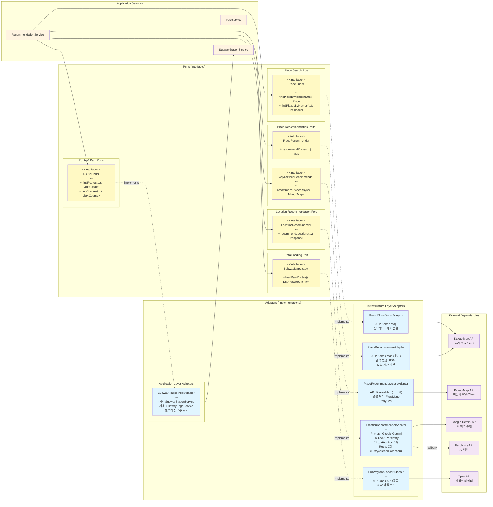

# Port-Adapter 상세 구조

이 다이어그램은 모든 Port 인터페이스와 Adapter 구현체의 관계를 상세히 보여줍니다.



## Port별 상세 설명

### 1. RouteFinder Port
```java
public interface RouteFinder {
    List<Route> findRoutes(List<StartEndPair> placePairs);
    List<Course> findCourses(List<StartEndPair> placePairs);
}
```
- **목적**: 두 지점 간 최적 경로 찾기
- **구현체**: `SubwayRouteFinderAdapter` (application layer)
- **알고리즘**: Dijkstra 최단 경로
- **의존성**: SubwayStationService, SubwayEdgeService (내부)

### 2. PlaceRecommender Port (동기)
```java
public interface PlaceRecommender {
    Map<Place, CategorizedRecommendedPlaces> recommendPlaces(
        List<Place> targetPlaces,
        List<RecommendCondition> requirements
    );
}
```
- **목적**: 특정 지점 주변 장소 추천 (동기)
- **구현체**: `PlaceRecommenderAdapter`
- **API**: Kakao Map API (RestClient)
- **특징**: 카테고리별 검색, 이미지 URL 추가, 도보 시간 계산

### 3. AsyncPlaceRecommender Port (비동기)
```java
public interface AsyncPlaceRecommender {
    Mono<Map<Place, CategorizedRecommendedPlaces>> recommendPlacesAsync(
        List<Place> targetPlaces,
        List<RecommendCondition> requirements
    );
}
```
- **목적**: 특정 지점 주변 장소 추천 (비동기)
- **구현체**: `PlaceRecommenderAsyncAdapter`
- **API**: Kakao Map API (WebClient)
- **특징**: Reactor 기반 병렬 처리, retry(2) 적용

### 4. LocationRecommender Port
```java
public interface LocationRecommender {
    RecommendedLocationsResponse recommendLocations(
        List<String> startingPlaces,
        List<String> candidatePlaces,
        List<RecommendCondition> requirements
    );
}
```
- **목적**: AI 기반 지역 추천
- **구현체**: `LocationRecommenderAdapter`
- **Primary API**: Google Gemini
- **Fallback API**: Perplexity
- **복원력**:
  - CircuitBreaker 2개 (normal, retryable)
  - Spring Retry (최대 2회)
  - Fallback 체인 (Gemini → Perplexity)

### 5. PlaceFinder Port
```java
public interface PlaceFinder {
    Place findPlaceByName(String placeName);
    List<Place> findPlacesByNames(List<String> placeNames);
}
```
- **목적**: 장소명으로 좌표 검색
- **구현체**: `KakaoPlaceFinderAdapter`
- **API**: Kakao Map API

### 6. SubwayMapLoader Port
```java
public interface SubwayMapLoader {
    List<RawRouteInfo> loadRawRoutes();
}
```
- **목적**: 지하철 노선 데이터 로드
- **구현체**: `SubwayMapLoaderAdapter`
- **데이터 소스**: CSV 파일 + Open API (공공 데이터)

## Adapter 계층 분리

### Application Layer Adapter
- **SubwayRouteFinderAdapter**: 내부 서비스만 사용 (외부 API 없음)
- 도메인 로직에 가까운 어댑터

### Infrastructure Layer Adapters
- **PlaceRecommenderAdapter**: Kakao API (동기)
- **PlaceRecommenderAsyncAdapter**: Kakao API (비동기)
- **LocationRecommenderAdapter**: Gemini + Perplexity API
- **KakaoPlaceFinderAdapter**: Kakao API
- **SubwayMapLoaderAdapter**: Open API
- 외부 시스템과의 실제 통신 담당

## 의존성 주입 (DI)

```java
@Service
public class RecommendationService {
    private final SubwayStationService subwayStationService;
    private final PlaceRecommender placeRecommender;  // @Qualifier로 선택
    private final AsyncPlaceRecommender asyncPlaceRecommender;
    private final LocationRecommender locationRecommender;
    private final RouteFinder routeFinder;  // @Qualifier로 선택

    public RecommendationService(
        SubwayStationService subwayStationService,
        @Qualifier("placeRecommenderAdapter") PlaceRecommender placeRecommender,
        @Qualifier("subwayRouteFinderAdapter") RouteFinder routeFinder,
        AsyncPlaceRecommender asyncPlaceRecommender,
        LocationRecommender locationRecommender
    ) {
        // ...
    }
}
```

## 테스트 용이성

Port-Adapter 패턴의 장점:
```java
// 프로덕션
@Component("placeRecommenderAdapter")
public class PlaceRecommenderAdapter implements PlaceRecommender { ... }

// 테스트
public class MockPlaceRecommender implements PlaceRecommender {
    @Override
    public Map<Place, CategorizedRecommendedPlaces> recommendPlaces(...) {
        return mockData;
    }
}
```

Port 인터페이스만 맞추면 Mock 구현체로 쉽게 교체 가능!