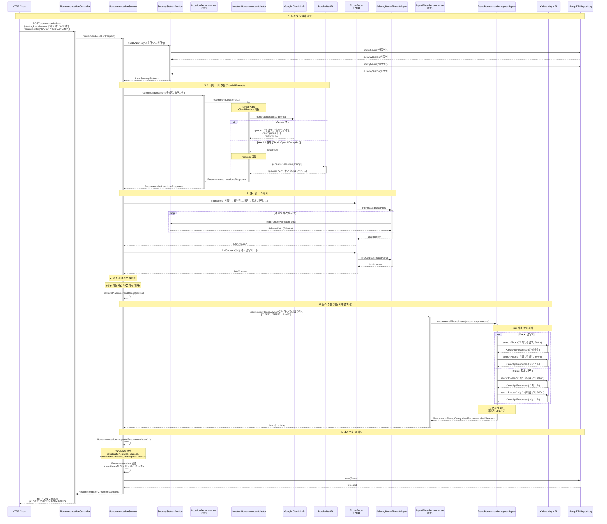
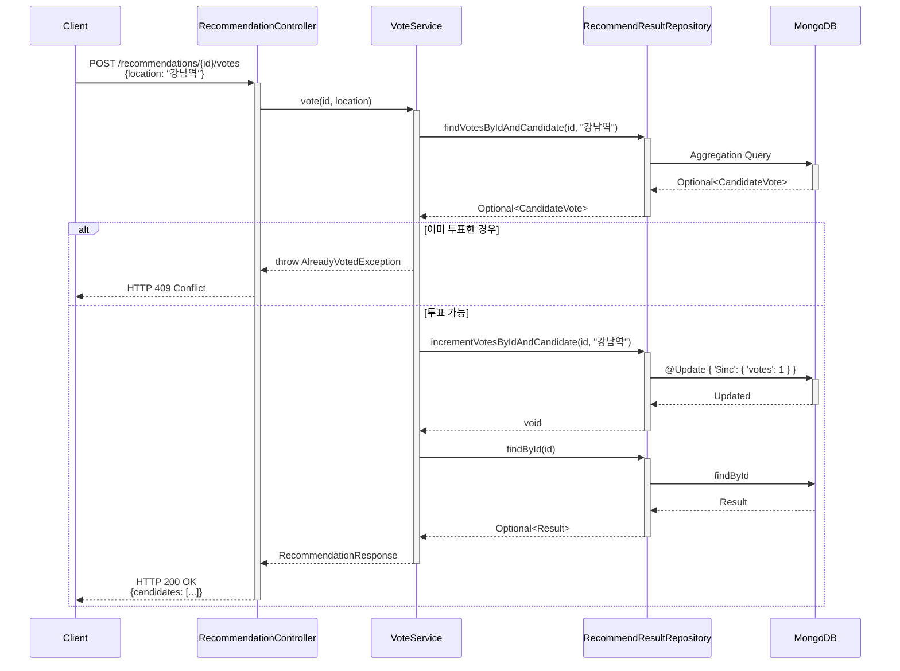
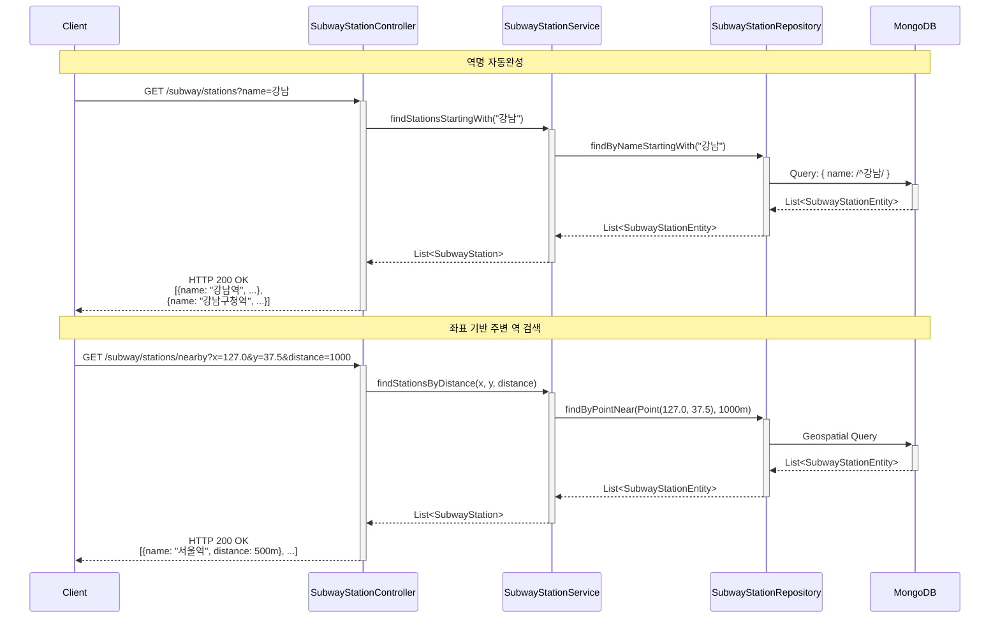
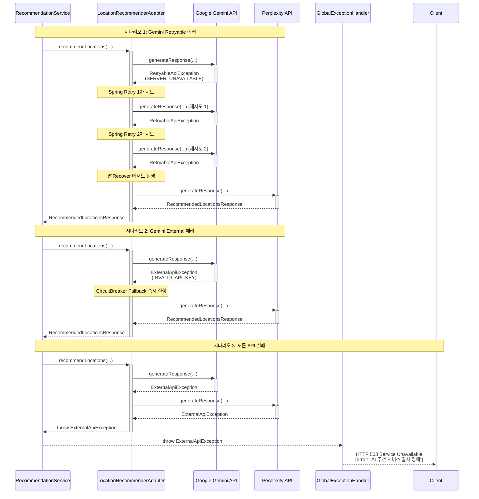

# 데이터 흐름 시퀀스 다이어그램

이 다이어그램은 추천 서비스의 실행 흐름을 시퀀스로 보여줍니다.

## 전체 추천 서비스 플로우



---

## 주요 처리 단계 상세 설명

### 1단계: 요청 및 출발지 검증
```java
// RecommendationService.java
List<SubwayStation> startingPlaces = getByNames(request.startingPlaceNames());
```
- MongoDB에서 출발지 역 정보 조회
- 존재하지 않는 역명 시 예외 발생

### 2단계: AI 기반 지역 추천
```java
RecommendedLocationsResponse locationResponse = locationRecommender.recommendLocations(
    request.startingPlaceNames(),
    candidatePlaces,
    request.requirements()
);
```

**복원력 흐름**:
```
Gemini 호출
  ↓
CircuitBreaker 1차 체크
  ↓
CircuitBreaker 2차 체크
  ↓
[성공] → 결과 반환
[실패] → Fallback → Perplexity 호출
[최대 재시도 초과] → @Recover → Perplexity 호출
```

### 3단계: 경로 및 코스 찾기
```java
List<Route> routes = routeFinder.findRoutes(allPairs);
List<Course> courses = routeFinder.findCourses(allPairs);
```

**경로 찾기 알고리즘**:
1. SubwayEdges에서 그래프 로드
2. Dijkstra 알고리즘으로 최단 경로 계산
3. SubwayPath → Route 도메인 모델 변환
4. Course 생성 (좌표 리스트)

### 4단계: 이동 시간 기준 필터링
```java
Map<Place, Routes> filteredPlaces = removePlacesBeyondRange(placeRoutes, generatedPlaces);
```

**필터링 조건**:
- 평균 이동 시간 계산: `Routes.getBestRecommendationTime()`
- 기준: 최선의 추천 시간 (가장 짧은 경로의 이동 시간)
- 제거: 30분 이상 소요되는 장소

### 5단계: 장소 추천 (비동기 병렬 처리)
```java
Map<Place, CategorizedRecommendedPlaces> recommendedPlaces =
    asyncPlaceRecommender.recommendPlacesAsync(generatedPlaces, conditions).block();
```

**병렬 처리 구조**:
```
Flux.fromIterable(places)  // [강남역, 홍대입구역, ...]
  .flatMap(place ->
    Flux.fromIterable(requirements)  // [CAFE, RESTAURANT, ...]
      .flatMap(req ->
        Flux.fromIterable(req.keywords())  // [카페, 커피숍, ...]
          .flatMap(keyword ->
            kakaoClient.searchPlacesAsync(keyword, place, 800m)
              .retry(2)
          )
      )
  )
```

**카테고리별 검색 키워드**:
- CAFE: ["카페", "커피숍", "디저트"]
- RESTAURANT: ["식당", "맛집", "음식점"]
- BAR: ["술집", "바", "펍"]
- STUDY_CAFE: ["스터디카페", "독서실"]
- PC_ROOM_KARAOKE: ["PC방", "노래방"]
- ACTIVITY: ["볼링", "당구", "스크린골프"]
- ENTERTAINMENT: ["영화관", "공연장", "방탈출"]

**도보 시간 계산**:
```java
int walkingTime = (int) (distance / 100 * 1.5);  // 100m당 1.5분
```

### 6단계: 결과 변환 및 저장
```java
Recommendation recommendation = recommendationMapper.toRecommendation(
    routes,
    courses,
    recommendedPlaces,
    locationResponse
);
```

**Recommendation 구조**:
```
Recommendation
├─ candidates: List<Candidate>  (평균 이동시간 순 정렬)
    ├─ destination: Place
    ├─ routes: Routes (출발지별 경로)
    ├─ courses: Courses (이동 코스)
    ├─ recommendedPlaces: CategorizedRecommendedPlaces
    ├─ description: String (AI 생성)
    ├─ reason: String (AI 생성)
    └─ votes: int (초기값 0)
```

**MongoDB 저장**:
```java
Result result = new Result(
    null,  // id는 MongoDB가 생성
    LocalDateTime.now(),
    recommendation,
    startingLocations,
    new HashSet<>(),  // votedLocations
    requirements
);
String id = recommendResultRepository.saveAndReturnId(result);
```

---

## 투표 기능 시퀀스



---

## 지하철 역 조회 시퀀스



---

## 에러 처리 흐름



---

## 성능 최적화 포인트

### 1. 비동기 병렬 처리
- **Before (동기)**: 장소 5개 × 조건 3개 × 키워드 3개 = 45회 순차 호출 (약 45초)
- **After (비동기)**: 45회 병렬 호출 (약 5초)
- **개선**: 9배 속도 향상

### 2. CircuitBreaker
- Gemini API 장애 시 즉시 Perplexity로 전환
- 연쇄 타임아웃 방지

### 3. Retry 전략
- RetryableApiException만 재시도 (일시적 오류)
- ExternalApiException은 즉시 Fallback (영구적 오류)

### 4. DTO 레이어 분리
- Port DTO (application.port.dto): Port 간 데이터 전달
- API DTO (ui.dto): HTTP 요청/응답
- Client DTO (infrastructure.client.*.dto): 외부 API 응답
- **효과**: 레이어 간 결합도 감소, 변경 영향 최소화

---

## 요약

이 시퀀스 다이어그램은 다음을 보여줍니다:

1. **요청부터 응답까지의 전체 흐름**
2. **Port-Adapter 패턴의 실제 동작**
3. **복원력 메커니즘의 작동 방식** (CircuitBreaker, Fallback, Retry)
4. **비동기 병렬 처리의 효율성**
5. **에러 처리 전략**

Port-Adapter 패턴 덕분에:
- Service는 외부 API 장애를 몰라도 됨
- Adapter가 복원력을 책임짐
- 외부 시스템 교체가 용이함