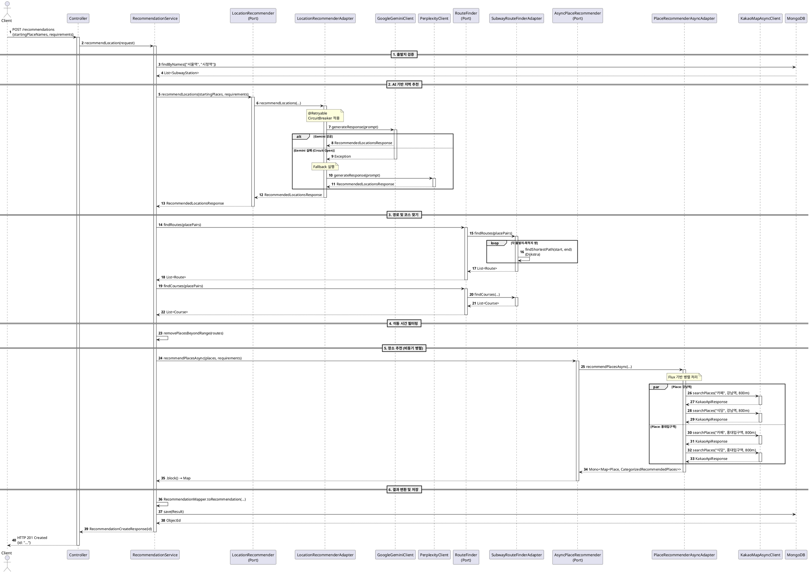
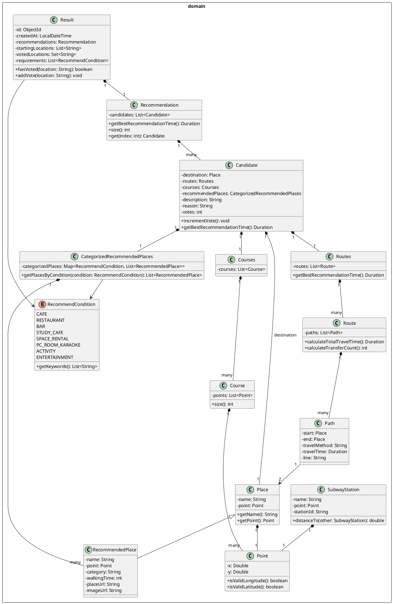

# PlantUML 다이어그램 모음

PlantUML로 작성된 상세한 UML 다이어그램입니다.

## 1. 컴포넌트 다이어그램 (Hexagonal Architecture)

```plantuml
@startuml hexagonal-architecture
!define RECTANGLE class

skinparam component {
    BackgroundColor<<port>> LightYellow
    BackgroundColor<<adapter>> LightBlue
    BackgroundColor<<service>> Wheat
    BackgroundColor<<domain>> LightGreen
    BackgroundColor<<external>> Lavender
}

package "UI Layer" {
    [RecommendationController] <<service>>
    [SubwayStationController] <<service>>
}

package "Application Layer" {
    [RecommendationService] <<service>>
    [VoteService] <<service>>
    [SubwayStationService] <<service>>

    package "Ports" {
        interface "RouteFinder" <<port>>
        interface "PlaceRecommender" <<port>>
        interface "AsyncPlaceRecommender" <<port>>
        interface "LocationRecommender" <<port>>
        interface "PlaceFinder" <<port>>
        interface "SubwayMapLoader" <<port>>
    }

    package "Application Adapter" {
        [SubwayRouteFinderAdapter] <<adapter>>
    }
}

package "Domain Layer" {
    [Place] <<domain>>
    [Route] <<domain>>
    [Candidate] <<domain>>
    [Recommendation] <<domain>>
    [SubwayStation] <<domain>>
}

package "Infrastructure Layer" {
    package "Infrastructure Adapters" {
        [LocationRecommenderAdapter] <<adapter>>
        [PlaceRecommenderAdapter] <<adapter>>
        [PlaceRecommenderAsyncAdapter] <<adapter>>
        [KakaoPlaceFinderAdapter] <<adapter>>
        [SubwayMapLoaderAdapter] <<adapter>>
    }

    package "External Clients" {
        [KakaoMapClient] <<external>>
        [KakaoMapAsyncClient] <<external>>
        [GoogleGeminiClient] <<external>>
        [PerplexityClient] <<external>>
        [OpenApiClient] <<external>>
    }

    database "MongoDB" {
        [SubwayStationRepository]
        [RecommendResultRepository]
    }
}

' UI to Application
RecommendationController --> RecommendationService
SubwayStationController --> SubwayStationService

' Application Service to Ports
RecommendationService --> RouteFinder
RecommendationService --> PlaceRecommender
RecommendationService --> AsyncPlaceRecommender
RecommendationService --> LocationRecommender
RecommendationService --> PlaceFinder

' Application Service to Domain
RecommendationService --> Place
RecommendationService --> Route
RecommendationService --> Candidate
RecommendationService --> Recommendation

' Ports to Adapters (implements)
SubwayRouteFinderAdapter ..|> RouteFinder
PlaceRecommenderAdapter ..|> PlaceRecommender
PlaceRecommenderAsyncAdapter ..|> AsyncPlaceRecommender
LocationRecommenderAdapter ..|> LocationRecommender
KakaoPlaceFinderAdapter ..|> PlaceFinder
SubwayMapLoaderAdapter ..|> SubwayMapLoader

' Application Adapter uses Services
SubwayRouteFinderAdapter --> SubwayStationService

' Infrastructure Adapters to External Clients
LocationRecommenderAdapter --> GoogleGeminiClient
LocationRecommenderAdapter --> PerplexityClient : fallback
PlaceRecommenderAdapter --> KakaoMapClient
PlaceRecommenderAsyncAdapter --> KakaoMapAsyncClient
KakaoPlaceFinderAdapter --> KakaoMapClient
SubwayMapLoaderAdapter --> OpenApiClient

' Services to Repository
SubwayStationService --> SubwayStationRepository
RecommendationService --> RecommendResultRepository

note right of RouteFinder
  Port (Interface)
  - 외부 시스템 추상화
  - 의존성 역전 지점
end note

note right of LocationRecommenderAdapter
  Adapter (Implementation)
  - CircuitBreaker 적용
  - Fallback: Gemini → Perplexity
  - Retry 메커니즘
end note

@enduml
```



---

## 2. 클래스 다이어그램 (Port & Adapter)

```plantuml
@startuml port-adapter-class
skinparam classAttributeIconSize 0

package "application.port" <<Rectangle>> {
    interface RouteFinder {
        + findRoutes(placePairs: List<StartEndPair>): List<Route>
        + findCourses(placePairs: List<StartEndPair>): List<Course>
    }

    interface PlaceRecommender {
        + recommendPlaces(targetPlaces: List<Place>, requirements: List<RecommendCondition>): Map<Place, CategorizedRecommendedPlaces>
    }

    interface AsyncPlaceRecommender {
        + recommendPlacesAsync(targetPlaces: List<Place>, requirements: List<RecommendCondition>): Mono<Map<Place, CategorizedRecommendedPlaces>>
    }

    interface LocationRecommender {
        + recommendLocations(startingPlaces: List<String>, candidatePlaces: List<String>, requirements: List<RecommendCondition>): RecommendedLocationsResponse
    }

    interface PlaceFinder {
        + findPlaceByName(placeName: String): Place
        + findPlacesByNames(placeNames: List<String>): List<Place>
    }

    interface SubwayMapLoader {
        + loadRawRoutes(): List<RawRouteInfo>
    }
}

package "application" <<Rectangle>> {
    class RecommendationService {
        - subwayStationService: SubwayStationService
        - placeRecommender: PlaceRecommender
        - asyncPlaceRecommender: AsyncPlaceRecommender
        - locationRecommender: LocationRecommender
        - routeFinder: RouteFinder
        - recommendationMapper: RecommendationMapper
        - repository: RecommendResultRepository

        + recommendLocation(request: RecommendationRequest): RecommendationCreateResponse
        - getByNames(names: List<String>): List<SubwayStation>
        - removePlacesBeyondRange(placeRoutes: Map, generatedPlaces: List): Map
    }
}

package "application.adapter" <<Rectangle>> {
    class SubwayRouteFinderAdapter {
        - subwayStationService: SubwayStationService
        - subwayEdgeService: SubwayEdgeService

        + findRoutes(placePairs: List<StartEndPair>): List<Route>
        + findCourses(placePairs: List<StartEndPair>): List<Course>
        - findShortestPath(start: SubwayStation, end: SubwayStation): SubwayPath
    }
}

package "infrastructure.adapter" <<Rectangle>> {
    class LocationRecommenderAdapter {
        - geminiClient: GoogleGeminiClient
        - perplexityClient: PerplexityClient
        - geminiBreaker: CircuitBreaker
        - geminiRetryableBreaker: CircuitBreaker
        - promptGenerator: PromptGenerator

        + recommendLocations(...): RecommendedLocationsResponse <<@Retryable>>
        + recoverRecommendedLocations(...): RecommendedLocationsResponse <<@Recover>>
    }

    class PlaceRecommenderAdapter {
        - kakaoMapClient: KakaoMapClient

        + recommendPlaces(...): Map<Place, CategorizedRecommendedPlaces>
        - searchRequirementsForPlace(...): Map.Entry
        - buildCategorizedRecommendedPlaces(...): CategorizedRecommendedPlaces
        - calculateWalkingTime(distance: int): int
    }

    class PlaceRecommenderAsyncAdapter {
        - kakaoMapAsyncClient: KakaoMapAsyncClient

        + recommendPlacesAsync(...): Mono<Map<Place, CategorizedRecommendedPlaces>>
        - searchRequirementsForPlaceAsync(...): Mono<Map.Entry>
    }

    class KakaoPlaceFinderAdapter {
        - kakaoMapClient: KakaoMapClient

        + findPlaceByName(placeName: String): Place
        + findPlacesByNames(placeNames: List<String>): List<Place>
    }

    class SubwayMapLoaderAdapter {
        - openApiClient: OpenApiClient

        + loadRawRoutes(): List<RawRouteInfo>
        - readCsv(): List<String>
    }
}

package "infrastructure.client" <<Rectangle>> {
    class KakaoMapClient {
        - restClient: RestClient
        - apiKey: String

        + searchPlacesBy(query: String, location: Point, radius: int): KakaoApiResponse
        + searchPointBy(placeName: String): Point
        + searchImagesBy(query: String): KakaoImageApiResponse
    }

    class KakaoMapAsyncClient {
        - webClient: WebClient
        - apiKey: String

        + searchPlacesByAsync(query: String, location: Point, radius: int): Mono<KakaoApiResponse>
    }

    class GoogleGeminiClient {
        - client: Client
        - modelName: String

        + generateResponse(...): RecommendedLocationsResponse
        - generate(contents: String, config: GenerationConfig): GenerateContentResponse
    }

    class PerplexityClient {
        - webClient: WebClient
        - apiKey: String
        - modelName: String

        + generateResponse(...): RecommendedLocationsResponse
    }

    class OpenApiClient {
        - restClient: RestClient
        - apiKey: String

        + searchShortestTimeRoute(start: String, end: String): SubwayRouteResponse
        + searchMinimumTransferRoute(start: String, end: String): SubwayRouteResponse
    }
}

package "domain" <<Rectangle>> {
    class Place {
        - name: String
        - point: Point
    }

    class Route {
        - paths: List<Path>

        + calculateTotalTravelTime(): Duration
        + calculateTransferCount(): int
    }

    class Recommendation {
        - candidates: List<Candidate>

        + getBestRecommendationTime(): Duration
        + size(): int
    }
}

' Relationships
RecommendationService --> RouteFinder
RecommendationService --> PlaceRecommender
RecommendationService --> AsyncPlaceRecommender
RecommendationService --> LocationRecommender

SubwayRouteFinderAdapter ..|> RouteFinder
PlaceRecommenderAdapter ..|> PlaceRecommender
PlaceRecommenderAsyncAdapter ..|> AsyncPlaceRecommender
LocationRecommenderAdapter ..|> LocationRecommender
KakaoPlaceFinderAdapter ..|> PlaceFinder
SubwayMapLoaderAdapter ..|> SubwayMapLoader

LocationRecommenderAdapter --> GoogleGeminiClient
LocationRecommenderAdapter --> PerplexityClient
PlaceRecommenderAdapter --> KakaoMapClient
PlaceRecommenderAsyncAdapter --> KakaoMapAsyncClient
KakaoPlaceFinderAdapter --> KakaoMapClient
SubwayMapLoaderAdapter --> OpenApiClient

RecommendationService --> Place
RecommendationService --> Route
RecommendationService --> Recommendation

@enduml
```



---

## 3. 시퀀스 다이어그램 (추천 서비스 플로우)



---

## 4. 복원력 패턴 다이어그램

```plantuml
@startuml resilience-patterns
!define RECTANGLE class

skinparam component {
    BackgroundColor<<retry>> LightYellow
    BackgroundColor<<circuit>> LightCoral
    BackgroundColor<<fallback>> LightGreen
}

package "LocationRecommenderAdapter" {
    component "@Retryable" <<retry>> [
        maxAttempts: 2
        retryFor: RetryableApiException
    ]

    component "CircuitBreaker 1\ngeminiBreaker" <<circuit>> [
        failureRateThreshold: 50%
        waitDurationInOpenState: 60s
    ]

    component "CircuitBreaker 2\ngeminiRetryableBreaker" <<circuit>> [
        failureRateThreshold: 50%
        waitDurationInOpenState: 60s
    ]

    component "Fallback Logic" <<fallback>> [
        ExternalApiException → Perplexity
        CallNotPermittedException → Perplexity
    ]

    component "@Recover" <<fallback>> [
        최종 실패 시 Perplexity 호출
    ]
}

component "Google Gemini API" as Gemini
component "Perplexity API" as Perplexity

"@Retryable" --> "CircuitBreaker 1"
"CircuitBreaker 1" --> "CircuitBreaker 2"
"CircuitBreaker 2" --> Gemini

"CircuitBreaker 2" .down.> "Fallback Logic" : Exception
"Fallback Logic" --> Perplexity

"@Retryable" .down.> "@Recover" : Max Attempts Exceeded
"@Recover" --> Perplexity

note right of "@Retryable"
  1차 방어: Spring Retry
  - 일시적 오류 재시도
  - RetryableApiException만
end note

note right of "CircuitBreaker 1"
  2차 방어: CircuitBreaker
  - 연쇄 장애 방지
  - Open 상태 시 즉시 차단
end note

note right of "Fallback Logic"
  3차 방어: Fallback
  - 대체 API 사용
  - Gemini → Perplexity
end note

@enduml
```

---

## 5. 도메인 모델 다이어그램



---

## PlantUML 사용 방법

### 온라인 렌더링
1. [PlantUML Online Editor](http://www.plantuml.com/plantuml/uml/)에 접속
2. 위 코드를 복사하여 붙여넣기
3. 실시간으로 다이어그램 확인

### VS Code 플러그인
```bash
# VS Code 확장 설치
1. "PlantUML" 확장 설치
2. Ctrl+Shift+P → "PlantUML: Preview Current Diagram"
```

### IntelliJ IDEA 플러그인
```bash
# IntelliJ 플러그인 설치
1. Settings → Plugins → "PlantUML integration" 검색
2. .puml 파일 생성하여 코드 작성
3. 자동으로 다이어그램 미리보기
```

### Gradle 빌드 통합
```gradle
plugins {
    id 'com.github.jruby-gradle.base' version '2.0.0'
}

task generateDiagrams(type: Exec) {
    commandLine 'java', '-jar', 'plantuml.jar', 'docs/diagrams/*.puml'
}
```

---

## 다이어그램별 사용 목적

| 다이어그램 | 목적 | 대상 독자 |
|-----------|------|----------|
| **컴포넌트 다이어그램** | 전체 아키텍처 구조 파악 | 아키텍트, 신입 개발자 |
| **클래스 다이어그램** | Port-Adapter 상세 설계 | 백엔드 개발자 |
| **시퀀스 다이어그램** | 런타임 동작 흐름 이해 | 모든 개발자 |
| **복원력 패턴** | 에러 처리 전략 이해 | DevOps, SRE |
| **도메인 모델** | 비즈니스 로직 이해 | 도메인 전문가, 개발자 |

---

## 다이어그램 업데이트 가이드

코드 변경 시 다이어그램도 함께 업데이트해야 합니다:

### 새로운 Port 추가 시
1. **컴포넌트 다이어그램**: 새 Port 인터페이스 추가
2. **클래스 다이어그램**: Port 인터페이스와 메서드 추가

### 새로운 Adapter 추가 시
1. **컴포넌트 다이어그램**: 새 Adapter 추가, Port와 연결
2. **클래스 다이어그램**: Adapter 클래스와 구현 관계 추가

### 새로운 외부 API 추가 시
1. **컴포넌트 다이어그램**: 새 Client 추가
2. **외부 API 의존성 맵** (Mermaid): 새 API와 복원력 메커니즘 추가
3. **클래스 다이어그램**: Client 클래스 추가

### 도메인 모델 변경 시
1. **도메인 모델 다이어그램**: 새 클래스/필드 추가

이렇게 다이어그램을 최신 상태로 유지하면, 프로젝트 구조를 쉽게 파악할 수 있습니다!